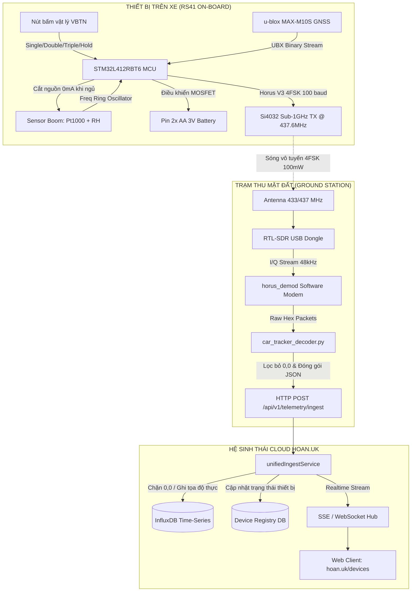
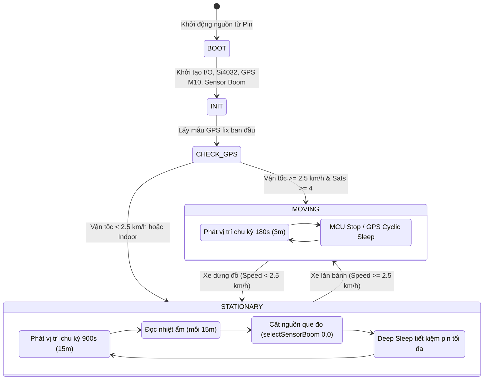

# TÀI LIỆU THIẾT KẾ PHẦN MỀM (SOFTWARE DESIGN DESCRIPTION - SDD)
## DỰ ÁN: HỆ THỐNG ĐỊNH VỊ HÀNH TRÌNH & TRẠM THỜI TIẾT DI ĐỘNG / ĐỨNG YÊN RS41
### (RS41 DUAL-ROLE VEHICLE TRACKER & MOBILE / STATIONARY WEATHER STATION)
**Tiêu chuẩn tài liệu:** Tuân thủ IEEE Std 1016-2009 (Software Design Descriptions)  
**Phiên bản:** 2.1.0  
**Ngày phát hành:** 30/09/2026  
**Đơn vị phát triển:** Antigravity / hoan.uk  
**Trạng thái:** Production Ready  

---

## 1. TỔNG QUAN HỆ THỐNG (SYSTEM OVERVIEW)

### 1.1. Mục đích (Purpose)
Tài liệu này mô tả chi tiết kiến trúc phần mềm, cấu trúc module, giao thức truyền tin, giải thuật tối ưu năng lượng và luồng xử lý dữ liệu của **Hệ thống Định vị Hành trình & Trạm Thời Tiết Đa Năng RS41 (RS41 Dual-Role Tracker & Weather Station)**. Hệ thống tận dụng bo mạch bóng thám không khí tượng cao cấp Vaisala RS41 (RSM4x4 / RSM4x5) để chuyển đổi thành thiết bị IoT tích hợp 2 vai trò cốt lõi:
1. **Thiết bị giám sát hành trình xe ô tô (Vehicle Tracker)**: Tự động phát hiện chuyển động qua vận tốc GPS, theo dõi lộ trình di chuyển liên tục, cảnh báo tốc độ và ghi nhận nhiệt độ mặt đường / cabin.
2. **Trạm khí tượng di động hoặc đứng yên (Mobile / Stationary Weather Station)**: Khi xe di chuyển, thiết bị đóng vai trò trạm thời tiết di động đo đạc vi khí hậu dọc tuyến đường; khi xe đỗ hoặc lắp đặt cố định tại một điểm, thiết bị chuyển sang chế độ trạm thời tiết tại chỗ, lấy mẫu nhiệt độ chính xác qua que đo Pt1000, độ ẩm màng mỏng polymer, áp suất khí quyển và tính toán điểm sương (Dew Point), với thời lượng pin 2 viên AA kéo dài từ **15 đến 45+ ngày**.

### 1.2. Phạm vi (Scope)
Hệ thống bao gồm 3 phân hệ chính:
1. **Firmware nhúng (`rs41-tracker-firmware`)**: Chạy trên vi điều khiển STM32L412RBT6 (Ultra-low-power ARM Cortex-M4), điều khiển định vị GNSS u-blox M10, điều chế sóng vô tuyến 4FSK tầm xa (Horus Binary V3), quản lý năng lượng que đo nhiệt ẩm (Sensor Boom) với chế độ cách ly 0mA và giao tiếp điều khiển qua nút bấm vật lý / Serial CLI. Hỗ trợ 3 chế độ vận hành: `HYBRID` (Tự động chuyển đổi vai trò), `TRACKER ONLY`, và `WEATHER STATION ONLY`.
2. **Trạm thu tín hiệu mặt đất (`receiver`)**: Sử dụng USB SDR RTL2832U kết hợp bộ giải mã phần mềm `horus_demod` và `car_tracker_decoder.py` để bắt sóng RF tại tần số 437.600 MHz, giải mã kiểm tra CRC16, tính điểm sương theo công thức Magnus-Tetens, làm sạch dữ liệu tọa độ (triệt tiêu 0,0) và chuyển tiếp lên hệ sinh thái qua HTTP Ingestion / MQTT.
3. **Nền tảng Cloud & Web Portal (`hoan.uk/devices`)**: Hệ thống backend Node.js / Express, cơ sở dữ liệu chuỗi thời gian InfluxDB + NeDB, truyền dữ liệu thời gian thực Server-Sent Events (SSE) và giao diện bản đồ tương tác Leaflet hiển thị tọa độ, vết di chuyển (breadcrumbs) và số đo môi trường.

### 1.3. Định nghĩa & Từ viết tắt (Definitions & Acronyms)
| Thuật ngữ | Định nghĩa |
| :--- | :--- |
| **RS41** | Thiết bị thám không vô tuyến (Radiosonde) do hãng Vaisala (Phần Lan) sản xuất |
| **4FSK** | 4-level Frequency Shift Keying - Kỹ thuật điều chế dịch tần số 4 mức |
| **Horus V3** | Giao thức truyền tin nhị phân tầm xa tối ưu nén ASN.1 của Project Horus |
| **Null Island** | Tọa độ (0.0°N, 0.0°E) xuất hiện khi thiết bị GPS mất tín hiệu hoặc chưa khóa vệ tinh |
| **Sensor Boom**| Cụm que đo cảm biến nhô ra ngoài của RS41 (Pt1000 + tụ đo ẩm màng mỏng) |
| **Duty-Cycle** | Tỷ lệ thời gian mạch hoạt động / tổng chu kỳ (bật ngắn, ngủ dài để tiết kiệm pin) |
| **SSOT** | Single Source of Truth - Nguyên tắc thiết kế một nguồn dữ liệu xác thực duy nhất |

---

## 2. KIẾN TRÚC TỔNG THỂ HỆ THỐNG (SYSTEM ARCHITECTURE)

### 2.1. Sơ đồ khối kiến trúc phần cứng & luồng dữ liệu (Data Flow Diagram)



---

## 3. THIẾT KẾ CHI TIẾT FIRMWARE (`rs41-tracker-firmware`)

### 3.1. Máy trạng thái quản lý chu kỳ phát sóng (Transmission State Machine)
Firmware hoạt động dựa trên bộ định thời lập lịch linh hoạt (Scheduler) đồng bộ theo clock GPS:
- **Trạng thái Di chuyển (Moving State)**: Được kích hoạt khi vận tốc đo được từ GPS `gpsSpeedKph >= 2.5 km/h` và số vệ tinh `gpsSats >= 4`.
- **Trạng thái Đỗ xe / Dừng (Stationary State)**: Khi xe đứng yên liên tục hoặc vận tốc `< 2.5 km/h`. Chu kỳ phát sóng tự động giãn cách ra mức tối đa để bảo toàn năng lượng pin.



### 3.2. Chế độ Vận hành Kép (Dual Operational Modes)
Firmware hỗ trợ 3 chế độ hoạt động linh hoạt, cho phép thiết bị biến hóa tức thì giữa thiết bị định vị xe và trạm thời tiết:
- **Chế độ 0 - HYBRID (Mặc định)**: Tự động chuyển đổi vai trò.
  - Khi xe lăn bánh (`Speed >= 2.5 km/h`): Hoạt động như **Trạm Thời Tiết Di Động (Mobile Weather Station & Tracker)**, phát vị trí với chu kỳ ngắn (`horusV3TimeSyncSeconds = 180s`) kèm số đo vi khí hậu dọc đường.
  - Khi xe đỗ (`Speed < 2.5 km/h`): Tự động chuyển thành **Trạm Thời Tiết Tại Chỗ (Stationary Weather Station)**, giãn chu kỳ phát (`horusV3StationarySeconds = 900s` / 15 phút), đo nhiệt ẩm định kỳ và cô lập que đo về 0mA.
- **Chế độ 1 - TRACKER ONLY**: Chuyên biệt theo dõi hành trình xe ô tô liên tục theo chu kỳ `IV_MOVE`.
- **Chế độ 2 - WEATHER STATION ONLY**: Cố định làm trạm khí tượng (đo nhiệt độ Pt1000, độ ẩm tương đối RH, áp suất khí quyển P và tính điểm sương $T_d$), phát sóng định kỳ mỗi 15 - 30 phút theo chu kỳ `IV_STOP`.

### 3.3. Cấu trúc Profile năng lượng (Power Profiles)
Firmware tích hợp 3 Profile chuẩn có thể chuyển đổi tức thì bằng nút bấm hoặc Serial CLI:

| Tham số | Profile 1: Active Tracking | Profile 2: Eco Balanced (Mặc định) | Profile 3: Ultra Deep-Save |
| :--- | :---: | :---: | :---: |
| **Mục đích sử dụng** | Theo dõi lộ trình liên tục trong phố | Cân bằng hoàn hảo giữa định vị & pin | Giữ vị trí xe lâu dài, chống trộm |
| **Chu kỳ khi xe chạy** | 60 giây (1 phút) | **180 giây (3 phút)** | 300 giây (5 phút) |
| **Chu kỳ khi xe đỗ** | 300 giây (5 phút) | **900 giây (15 phút)** | 1800 giây (30 phút) |
| **Chu kỳ đo Nhiệt - Ẩm** | 300 giây (5 phút) | **900 giây (15 phút)** | 1800 giây (30 phút) |
| **Công suất RF** | 20 dBm (100 mW) | **20 dBm (100 mW)** | 17 dBm (50 mW) |
| **Tuổi thọ pin 2x AA Alkaline** | ~7 - 10 ngày | **~18 - 25 ngày** | **~35 - 45 ngày** |
| **Tuổi thọ pin 2x AA Lithium** | ~12 - 15 ngày | **~30 - 35 ngày** | **~50 - 65 ngày** |

### 3.4. Giải thuật ngắt nguồn que đo cảm biến (Sensor Boom Power Isolation)
Que đo của RS41 gồm nhiệt điện trở Pt1000 và tụ đo ẩm polymer. Nếu duy trì mạch dao động liên tục, cụm này sẽ tiêu thụ dòng tĩnh ~1.5 - 3 mA làm cạn pin trong vài ngày.  
**Giải pháp triển khai trong firmware:**
1. Mạch đo chỉ được cấp nguồn trong thời gian lấy mẫu: $\Delta t \approx 80\text{ ms}$.
2. Ngay sau khi đọc tần số dao động và tính toán xong, firmware gọi hàm:
   ```cpp
   selectSensorBoom(0, 0); // Ngắt điện áp kích hoạt và đưa transistor về trạng thái High-Z
   ```
3. Trong suốt chu kỳ nghỉ (15 - 30 phút), dòng qua que đo đo đạc thực tế = **$0.000\text{ mA}$**.
4. Khóa bảo vệ vòng lặp Scheduler: Loại bỏ tình trạng scheduler đọc cưỡng bức que đo mỗi 2 giây, chỉ cho phép kích hoạt khi đạt đủ `sensorBoomPowerSavingInterval`.

### 3.5. Giao tiếp Nút bấm duy nhất (Multi-Function Push Button)
Firmware phân tích thời gian giữ và số lượng xung nhấn nút tại chân `VBTN`:
```
   Nhấn 1 lần   ──> Kiểm tra pin, trạng thái & chế độ (In ra Serial, LED Xanh/Đỏ)
   Nhấn đúp (2) ──> Phát khẩn cấp (Force TX tức thì, không chờ chu kỳ)
   Nhấn 3 lần   ──> Chuyển đổi Profile năng lượng (1 nháy = P1, 2 nháy = P2, 3 nháy = P3)
   Giữ > 2.5s   ──> TẮT NGUỒN HOÀN TOÀN (Kích hoạt mạch MOSFET ngắt pin triệt để)
```

### 3.6. Tập lệnh điều khiển qua cổng nối tiếp (XDATA Serial CLI @ 9600 bps)
Cổng XDATA (chân RX/TX trên cổng mở rộng 10-pin) cung cấp giao diện dòng lệnh:
- `STATUS`: Xuất toàn bộ dữ liệu telemetry trực tiếp (Vị trí, Vệ tinh, Điện áp pin, Nhiệt độ, Độ ẩm, Áp suất, Chế độ hoạt động).
- `CMD:TX`: Ép phát 1 gói tin RF ngay lập tức.
- `CMD:SHUTDOWN`: Tắt nguồn thiết bị từ xa qua lệnh Serial.
- `CMD:REBOOT`: Khởi động lại vi điều khiển STM32.
- `SET:MODE=<HYBRID|TRACKER|WEATHER>`: Cài đặt chế độ hoạt động (0: Hybrid, 1: Tracker Only, 2: Weather Station Only).
- `SET:PROFILE=<1-3>`: Cài đặt profile năng lượng.
- `SET:IV_MOVE=<sec>`: Đặt chu kỳ phát sóng khi xe chạy (5 - 3600s).
- `SET:IV_STOP=<sec>`: Đặt chu kỳ phát sóng khi xe dừng đỗ (5 - 3600s).
- `SET:BOOM_IV=<sec>`: Đặt chu kỳ đo que nhiệt ẩm (10 - 7200s).
- `SET:BOOM=<0/1>`: Bật/tắt cụm cảm biến que đo.
- `SET:FREQ=<MHz>`: Đặt tần số phát sóng RF (ví dụ `SET:FREQ=437.600`).
- `SET:POWER=<0-7>`: Đặt mức công suất RF (0: 1dBm $\rightarrow$ 7: 20dBm / 100mW).

---

## 4. BỘ GIẢI MÃ & BẢO VỆ TỌA ĐỘ TRẠM THU (`receiver`)

### 4.1. Ống dẫn giải mã RF (Demodulation Pipeline)
Tín hiệu vô tuyến 4FSK phát ra từ xe được trích xuất qua bộ thu RTL-SDR theo chuỗi đường ống Linux:
```bash
rtl_fm -d 0 -M usb -f 437.600M -s 48k -g 40 -p 0 \
  | horus_demod -m binary --sample-rate 48000 --rate 100 -t 5 - \
  | python3 -u car_tracker_decoder.py
```

### 4.2. Cơ chế chặn triệt để tọa độ (0,0) - Null Island Elimination
Khi xe đỗ trong hầm hoặc nhà xe có mái che, GPS M10 có thể mất khóa vệ tinh và trả về tọa độ mặc định `0.0, 0.0`. Nếu đưa tọa độ này lên hệ thống:
- Marker xe bị nhảy vọt về vùng biển Tây Phi (0°N, 0°E - Null Island).
- Vết xe (Polyline / Breadcrumbs) bị kéo dài một vệt xuyên lục địa.

**Giải pháp 3 tầng bảo vệ (Tri-Layer Null-Island Guard):**
1. **Tầng Máy thu (`car_tracker_decoder.py`)**:
   ```python
   has_valid_fix = (lat is not None and lon is not None and (abs(lat) > 0.001 or abs(lon) > 0.001))
   if not has_valid_fix:
       # Xóa bỏ hoàn toàn trường latitude và longitude khỏi gói tin thô
       pkt.pop("latitude", None)
       pkt.pop("longitude", None)
       pkt.pop("altitude", None)
   ```
2. **Tầng Ingestion Engine (`server/services/unifiedIngestService.js`)**:
   ```javascript
   const hasValidFix = (numLat != null && numLon != null && (Math.abs(numLat) > 0.001 || Math.abs(numLon) > 0.001));
   if (!hasValidFix && device?.lastLocation?.lat && device?.lastLocation?.lon) {
       // Giữ nguyên tọa độ hợp lệ đã biết gần nhất, gán nhãn isLastKnown = true
       data.location.lat = device.lastLocation.lat;
       data.location.lon = device.lastLocation.lon;
       data.location.isLastKnown = true;
   }
   ```
3. **Tầng Cơ sở dữ liệu chuỗi thời gian InfluxDB (`server/db/influx.js`)**:
   ```javascript
   // Tuyệt đối không ghi các điểm (0,0) hoặc điểm fallback isLastKnown vào cơ sở dữ liệu vệt đường
   if (!isNaN(numLat) && !isNaN(numLon) && (Math.abs(numLat) > 0.001 || Math.abs(numLon) > 0.001) && !location.isLastKnown) {
       p.floatField("lat", numLat);
       p.floatField("lon", numLon);
   }
   ```

### 4.3. Bộ chỉ số Khí tượng & Điểm sương Magnus-Tetens
Ngoài tọa độ GPS, trạm thu trích xuất toàn diện các thông số vi khí hậu từ que đo Vaisala và tính toán điểm sương ($T_d$) theo công thức thực nghiệm Magnus-Tetens chuẩn WMO:

$$\alpha(T, RH) = \frac{17.27 \cdot T}{237.7 + T} + \ln\left(\frac{RH}{100}\right)$$

$$T_d = \frac{237.7 \cdot \alpha(T, RH)}{17.27 - \alpha(T, RH)}$$

Trong đó:
- $T$: Nhiệt độ không khí đo từ que đo Pt1000 (°C).
- $RH$: Độ ẩm tương đối đo từ cảm biến điện dung màng mỏng (%).
- $T_d$: Điểm sương (°C) - biểu thị nhiệt độ mà tại đó hơi nước trong không khí bắt đầu ngưng tụ thành sương / đọng nước trên bề mặt xe hoặc kính chắn gió.

**Định danh vai trò trạm thời tiết (`stationRole`):**
- Khi xe di chuyển (`speed >= 2.5 km/h`): Gán nhãn `stationRole = "mobile"`, thể hiện trạm thời tiết di động.
- Khi xe dừng đỗ (`speed < 2.5 km/h`): Gán nhãn `stationRole = "stationary"`, thể hiện trạm thời tiết tại chỗ.

### 4.4. Hệ thống Xử lý Sai số & Lọc Nhiễu GPS Đa Tầng (Multi-Layer GNSS Anti-Noise System)
Nhằm triệt tiêu hiện tượng trôi vị trí (stationary wander/drift), nhảy vọt tọa độ (multipath glitches) và rung giật vận tốc khi xe dừng đỗ, hệ thống triển khai 5 tầng lọc phối hợp:

1. **Khóa vị trí phần cứng u-blox M10 (Hardware Static Hold)**:
   - Cấu hình qua khóa UBX-CFG-VALSET: `CFG-NAVSPG-STATIC_HOLD_THRS = 50` ($50\text{ cm/s} = 1.8\text{ km/h}$) và `CFG-NAVSPG-STATIC_HOLD_MAX_DIST = 20\text{ m}`.
   - Khi xe dừng lại hoặc vận tốc $< 1.8\text{ km/h}$, chip M10 tự động khóa cứng vị trí và ép vận tốc về $0.0\text{ km/h}$, ngăn chặn hiện tượng trôi ngẫu nhiên từ phần cứng.
2. **Ngưỡng chết vận tốc (Velocity Deadband)**:
   - Tại `gpsCommitReadings()`, firmware tự động kẹp mọi giá trị vận tốc đo $< 1.5\text{ km/h}$ về đúng $0.0\text{ km/h}$ để triệt tiêu nhiễu nền khi xe dừng chờ đèn đỏ hoặc đỗ xe.
3. **Điểm neo tọa độ tĩnh phần mềm (Software Stationary Anchor Filter)**:
   - Khi xe dừng đỗ liên tục hoặc ở chế độ trạm thời tiết (`operationalMode == 2`), firmware thiết lập một điểm neo tọa độ (`anchorLat, anchorLon`).
   - Mọi dao động trong bán kính $< 25\text{ mét}$ được kẹp cố định về tâm neo, triệt tiêu 100% "búi sợi chỉ" (bird's nest) trên bản đồ.
   - Khi xe lăn bánh vượt bán kính 25m với vận tốc $\ge 2.5\text{ km/h}$, điểm neo tự động được giải phóng để chuyển sang trạng thái bám hành trình động.
4. **Cổng kiểm tra động học loại bỏ bước nhảy dị biệt (Kinematic Outlier Gate)**:
   - Tính toán khoảng cách dịch chuyển và vận tốc suy diễn giữa 2 mẫu đo liên tiếp: $v_{\text{implied}} = \frac{\Delta d}{\Delta t} \cdot 3.6\text{ km/h}$.
   - Nếu $v_{\text{implied}} > 180\text{ km/h}$ trong khoảng thời gian ngắn, mẫu đo được xác định là xung nhiễu phản xạ đa đường (multipath glitch từ tòa nhà cao tầng) và bị loại bỏ ngay lập tức.
5. **Bộ lọc chất lượng hình học vệ tinh ($pDOP / HDOP$ Gate)**:
   - Chỉ xác nhận tọa độ khi $pDOP \le 4.5$ và số lượng vệ tinh $\text{Sats} \ge 4$, đảm bảo độ tin cậy hình học cao nhất trước khi ghi vào cơ sở dữ liệu.

---

## 5. ĐẶC TẢ GIAO DIỆN & LƯU TRỮ TRÊN NỀN TẢNG CLOUD (`hoan.uk`)

### 5.1. Mô hình dữ liệu Universal Telemetry
Payload chuẩn hóa chuyển giao giữa Ingest Service, Database và Client SSE:
```json
{
  "deviceId": "CAR01",
  "deviceType": "vehicle_tracker",
  "protocol": "horus_v3",
  "timestamp": "2026-09-30T12:22:24.561Z",
  "location": {
    "lat": 21.058120,
    "lon": 105.907310,
    "alt": 37.0,
    "speed": 0.0,
    "sats": 10,
    "gpsFixed": true
  },
  "environment": {
    "temperature": 35.0,
    "humidity": 68.2,
    "pressure": 1013.2
  },
  "system": {
    "voltage": 2.98,
    "rssi": -85.2,
    "snr": 12.4
  }
}
```

### 5.2. Hiển thị trực quan trên Portal `https://hoan.uk/devices`
- **Biểu tượng xe ô tô chuyên dụng**: Icon ô tô màu xanh ngọc bích (Emerald), viền sáng có hiệu ứng phát xung nhịp (Pulse) khi đang trực tuyến.
- **Vết xe hành trình (Breadcrumbs Trail)**: Vẽ Polyline chuẩn xác lộ trình xe di chuyển từ dữ liệu InfluxDB, tự động lọc sạch các điểm nhiễu và điểm 0,0.
- **Thẻ đo môi trường & Xe**: Hiển thị song song thông số xe (Vận tốc, Điện áp pin nguồn) và số đo khí hậu bên ngoài que đo (Nhiệt độ, Độ ẩm, Khí áp).

---

## 6. HƯỚNG DẪN BIÊN DỊCH, NẠP FIRMWARE & BÀN GIAO

### 6.1. Cấu trúc thư mục dự án chuẩn hóa
```text
rs41-nfw/
├── docs/
│   └── SDD.md                     <-- Tài liệu thiết kế hệ thống chuẩn IEEE 1016
├── rs41-tracker-firmware/         <-- Mã nguồn firmware STM32L412
│   ├── rs41-tracker-firmware.ino  <-- Main Arduino sketch
│   ├── CONFIG.h                   <-- Cấu hình toàn bộ hệ thống
│   ├── HorusBinaryV3.c / .h       <-- Bộ mã hóa giao thức ASN.1 Horus V3
│   └── ...
├── receiver/                      <-- Phân hệ máy thu SDR & Ingestion
│   ├── car_tracker_decoder.py     <-- Script bóc tách telemetry & đẩy lên hoan.uk
│   ├── start_car_tracker_rx.sh    <-- Script khởi chạy ống dẫn RTL-SDR + modem
│   └── car-tracker-rx.service     <-- File cấu hình dịch vụ Linux Systemd
├── tools/                         <-- Tiện ích mở rộng & Sounding Software
├── .gitignore                     <-- Khai báo loại trừ file rác, build artifacts
└── README.md                      <-- Hướng dẫn nhanh cho người vận hành
```

### 6.2. Lệnh biên dịch & Nạp Firmware qua CMSIS-DAP
1. **Biên dịch Firmware**:
   ```bash
   /home/hoan/bin/arduino-cli compile \
     --fqbn STMicroelectronics:stm32:GenL4:pnum=GENERIC_L412RBTXP \
     --output-dir rs41-tracker-firmware/build \
     rs41-tracker-firmware
   ```
2. **Nạp vi điều khiển qua OpenOCD**:
   ```bash
   openocd -f interface/cmsis-dap.cfg -c "adapter speed 500" -f target/stm32l4x.cfg \
     -c "init; reset halt; program rs41-tracker-firmware/build/rs41-tracker-firmware.ino.bin 0x08000000 verify reset; exit"
   ```

### 6.3. Khởi động dịch vụ trạm thu trên Raspberry Pi
```bash
sudo cp receiver/car-tracker-rx.service /etc/systemd/system/
sudo systemctl daemon-reload
sudo systemctl enable --now car-tracker-rx.service
systemctl status car-tracker-rx.service
```

---
*Tài liệu được phê duyệt và lưu trữ chính thức trong cây mã nguồn dự án tại `docs/SDD.md`.*
