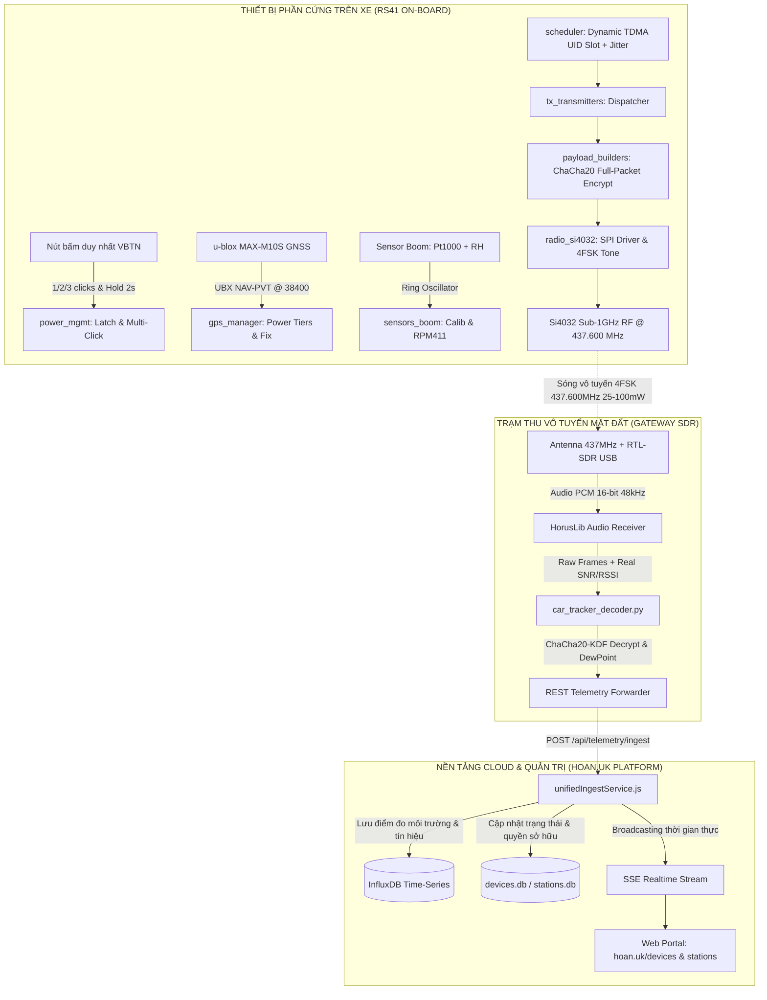
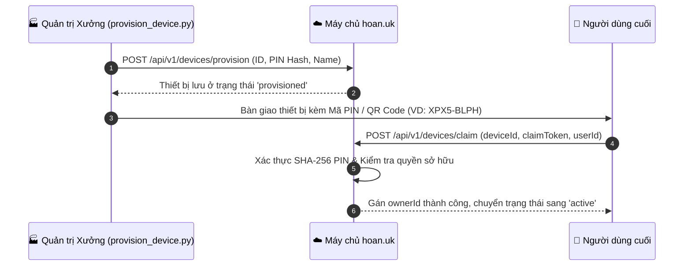

# TÀI LIỆU THIẾT KẾ PHẦN MỀM (SOFTWARE DESIGN DESCRIPTION - SDD)
## DỰ ÁN: HỆ THỐNG ĐỊNH VỊ HÀNH TRÌNH & TRẠM THỜI TIẾT IOT RS41
### (RS41 DUAL-ROLE ENTERPRISE VEHICLE TRACKER & WEATHER OBSERVATORY)
**Tiêu chuẩn tài liệu:** Tuân thủ chuẩn quốc tế IEEE Std 1016-2009 (Software Design Descriptions)  
**Phiên bản:** 3.0.0 (Comprehensive Enterprise Edition)  
**Ngày phát hành:** 01/10/2026  
**Đơn vị phát triển:** Antigravity / hoan.uk Engineering Team  
**Trạng thái:** Production Ready & Verified on Hardware  

---

## 1. TỔNG QUAN HỆ THỐNG (SYSTEM OVERVIEW)

### 1.1. Mục đích (Purpose)
Tài liệu này định nghĩa kiến trúc phần mềm, cấu trúc module, thiết kế giao thức mật mã, giải thuật điều phối vô tuyến và luồng xử lý dữ liệu của **Hệ thống Định vị Hành trình & Trạm Khí tượng IoT Doanh nghiệp RS41**. Hệ thống tái sinh bo mạch bóng thám không khí tượng cao cấp Vaisala RS41 (dòng RSM4x4 / RSM4x5 chạy MCU STM32L412KB) thành thiết bị IoT lưỡng dụng đa năng:
1. **Thiết bị giám sát hành trình phương tiện (Vehicle Tracker)**: Tự động phát hiện chuyển động theo vận tốc GNSS u-blox M10, theo dõi lộ trình di chuyển liên tục, chống phát lại và truyền tọa độ tầm xa qua sóng vô tuyến Sub-1GHz 4FSK.
2. **Trạm khí tượng di động hoặc cố định (Mobile / Stationary Weather Observatory)**: Lấy mẫu vi khí hậu chính xác cao bằng cảm biến nhiệt Pt1000, độ ẩm màng mỏng polymer và áp suất khí quyển RPM411; tự động tính điểm sương (Dew Point), với thời lượng pin 2 viên AA kéo dài từ **15 đến 45+ ngày**.
3. **Mã hóa an ninh cấp quân sự (ChaCha20 RFC 8439)**: Bảo mật 100% tọa độ và dữ liệu viễn trắc trên không gian, không phát sinh dù chỉ 1 bit vô tuyến dư thừa.

### 1.2. Phạm vi Kiến trúc (Scope)
Hệ thống bao gồm 4 phân hệ chính hoạt động thống nhất:
1. **Firmware Nhúng Modular (`rs41-tracker-firmware`)**: Cấu trúc module C++ tách biệt (12 subsystem headers), tối ưu hóa bộ nhớ RAM/Flash cho STM32L412, tích hợp máy trạng thái nút bấm đa năng, cơ chế tắt LED triệt để, lập lịch TDMA động theo Silicon Chip UID chống trùng sóng, và mã hóa dòng ChaCha20 256-bit.
2. **Trạm thu Mặt đất Đa giao thức (`receiver`)**: Khai thác USB RTL-SDR kết hợp modem phần mềm HorusLib (bắt trực tiếp luồng Audio PCM 16-bit 48kHz), tự động bóc tách SNR (dB), RSSI (dBm), kiểm tra CRC16, giải mã ChaCha20 thời gian thực và chuyển tiếp qua REST Ingest.
3. **Máy chủ Thu thập & Phân tích Dữ liệu (`server`)**: Dịch vụ `unifiedIngestService`, cơ sở dữ liệu chuỗi thời gian InfluxDB v2, thanh ghi thiết bị NeDB, hệ thống ngưỡng đếm Offline thích ứng (Adaptive Timeout 25 phút), và kênh phát dữ liệu thời gian thực Server-Sent Events (SSE).
4. **Cổng Thông tin Quản lý & Giám sát (`hoan.uk/devices` & `hoan.uk/stations`)**: Giao diện người dùng Web phản ứng nhanh (React/Leaflet), tích hợp quy trình nhận quyền sở hữu thiết bị (Claim Device qua Token/QR Code) và bảng điều khiển viễn thám phần cứng chi tiết.

### 1.3. Bảng Thuật ngữ & Ký hiệu (Definitions & Acronyms)
| Thuật ngữ | Định nghĩa |
| :--- | :--- |
| **RS41** | Radiosonde Vaisala RS41 (dòng RSM4x4 / RSM4x5 dùng vi điều khiển STM32L412KB) |
| **4FSK** | 4-level Frequency Shift Keying - Điều chế dịch tần 4 mức tốc độ 100 baud |
| **ChaCha20** | Thuật toán mã hóa dòng 256-bit chuẩn RFC 8439 tốc độ cao, tối ưu ARM Cortex-M4 |
| **KDF** | Key Derivation Function - Hàm phái sinh khóa thiết bị từ Root Master Key |
| **TDMA** | Time Division Multiple Access - Phân chia khe thời gian phát sóng tránh nghẽn kênh |
| **UID** | 96-bit Unique Silicon Identifier tích hợp sẵn trong vi điều khiển STM32 |
| **HorusLib** | Thư viện demodulator xử lý tín hiệu số audio FSK trực tiếp từ RTL-SDR |
| **Sensor Boom**| Thanh đo cảm biến nhô ra ngoài của RS41 (Pt1000 + tụ đo ẩm màng mỏng) |
| **SSOT** | Single Source of Truth - Nguyên tắc thiết kế một nguồn dữ liệu xác thực duy nhất |

---

## 2. KIẾN TRÚC TỔNG THỂ HỆ THỐNG (SYSTEM ARCHITECTURE)



---

## 3. THIẾT KẾ CHI TIẾT FIRMWARE MODULAR (`rs41-tracker-firmware`)

### 3.1. Tái cấu trúc Phân rã Modular (Modular Subsystem Partitioning)
Nhằm xóa bỏ hoàn toàn rủi ro bảo trì của file nguyên khối cũ (7.248 dòng code), kiến trúc firmware mới được chia thành **12 module header** chuẩn kỹ thuật nhúng:

```mermaid
graph TD
    Main[rs41-tracker-firmware.ino<br>Main Entry: ~270 dòng]
    
    Main --> Pins[pins_rs41.h: Hardware Pins & Serial]
    Main --> Globals[globals.h: State Variables & Buffers]
    Main --> Led[led_ctrl.h: Visual Primitives & Eco Off]
    Main --> Radio[radio_si4032.h: SPI Driver & FSK Tone Gen]
    Main --> Payloads[payload_builders.h: ChaCha20 & APRS AX.25]
    Main --> Tx[tx_transmitters.h: RF Dispatcher]
    Main --> Power[power_mgmt.h: Latch Shutdown & Clicks]
    Main --> Sensors[sensors_boom.h: Boom Ring Osc & RPM411]
    Main --> Gps[gps_manager.h: u-blox UBX & Power Tiers]
    Main --> Calib[calibration_stages.h: Self-Test & Foxhunt]
    Main --> Sched[scheduler.h: Dynamic UID TDMA & Jitter]
    Main --> Cli[cli_interface.h: Serial CLI & $NFW Stream]
```



### 3.2. Đặc tả Chi tiết các Module Subsystems:

#### 1. `pins_rs41.h` (Hardware Definitions & Serial Routing)
- Phân loại phần cứng tự động giữa `RSM4x4` (STM32L412) và `RSM4x2` (STM32F100).
- Cấu hình chân `PSU_SHUTDOWN_PIN` (PA9 trên L412), `VBAT_PIN` (PA5), `VBTN_PIN` (PA6), `CS_RADIO_SPI` (PC13).
- Định nghĩa phân vùng bộ nhớ đệm dùng chung `NfwTxScratch g_txScratch` (Zero heap allocation).

#### 2. `led_ctrl.h` (Bộ điều khiển LED & Tiết kiệm Pin Triệt để)
- Cung cấp các hàm nguyên thủy: `redLed()`, `greenLed()`, `orangeLed()`, `bothLedOff()`.
- **Tối ưu hóa năng lượng**: Ngay khi mất GPS fix hoặc đang trong giai đoạn chờ khe phát, firmware tự động ngắt toàn bộ LED (`bothLedOff()`). Tuyệt đối không duy trì LED sáng liên tục gây lãng phí pin.

#### 3. `power_mgmt.h` (Mạch chốt Nguồn MOSFET & Máy trạng thái Nút bấm)
- **Mạch chốt nguồn phần cứng (Power Latch)**:
  - Khi bật nguồn, giữ `PSU_SHUTDOWN_PIN` ở mức `LOW` để duy trì mở transistor Q502.
  - Khi tắt nguồn (`hardwarePowerShutdown()`): Đưa chân `PSU_SHUTDOWN_PIN` lên `HIGH`, kích hoạt Q503 kéo cực cổng Q502 về GND; chờ giải phóng nút bấm vật lý (ngăn chặn tiếp điểm dội cơ học kích hoạt lại) rồi đưa vi điều khiển vào chế độ `HAL_PWREx_EnterSHUTDOWNMode()`.
- **Máy trạng thái Nút bấm đa năng (Multi-Click Engine)**:
  - **1 Click (Single Click)**: Đánh thức thiết bị và kích hoạt phát gói tin RF tức thì (`triggerImmediateTx(false)`), chấp nhận phát ngay dù chưa có GPS fix.
  - **2 Clicks (Double Click)**: Đánh thức thiết bị, kích hoạt GPS tìm fix tươi mới rồi mới phát sóng (`triggerImmediateTx(true)`).
  - **3 Clicks (Triple Click)**: Chuyển đổi Profile năng lượng tuần hoàn (Profile 1 $\to$ Profile 2 $\to$ Profile 3).
  - **Giữ nút $\ge 2.0$s (Long Hold)**: Tắt nguồn dứt điểm, ngắt dòng pin hoàn toàn.
  - **Trạng thái đang tắt**: Nhấn 1 lần để bật nguồn thiết bị.

#### 4. `radio_si4032.h` (SPI Driver Chip Vô tuyến Si4032)
- Driver thanh ghi SPI cho bộ phát Si4032 tại tần số 437.600 MHz.
- Cấu hình công suất linh hoạt: $0$ (1 dBm) đến $7$ (20 dBm / 100 mW).
- Điều chế 4FSK thời gian thực (`fsk4_tone()`, `fsk4_preamble()`, `fsk4_write()`).

#### 5. `payload_builders.h` (Đóng gói Dữ liệu & Mã hóa ChaCha20)
- Tích hợp động cơ mã hóa dòng ChaCha20 256-bit độc lập (`chacha20.h`).
- Đóng gói khung 32 bytes chuẩn Enterprise IoT (Marker `0x03`).
- Đóng gói tương thích ngược cho APRS HAB / Weather và RTTY.

#### 6. `tx_transmitters.h` (Điều phối Phát sóng)
- Quản lý điều độ phát `horusV3Tx()`, `aprsTx()`, `rttyTx()`, `morseTx()`.

#### 7. `sensors_boom.h` (Que đo Nhiệt Ẩm & Áp suất RPM411)
- Điều khiển cách ly que đo: Cắt dòng tĩnh về $0.000\text{ mA}$ trong thời gian nghỉ bằng `selectSensorBoom(0, 0)`.
- Hiệu chuẩn nhiệt độ đa thức polynomial Vaisala và giao tiếp I2C với module cảm biến áp suất RPM411 BARO-CAP.

#### 8. `gps_manager.h` (u-blox UBX Binary Protocol)
- Giao tiếp nhị phân UBX NAV-PVT qua UART @ 38400 baud.
- Quản lý 3 nấc năng lượng thông minh (Intelligent GPS Tiers) phù hợp số lượng vệ tinh bắt được.
- Chế độ im lặng GPS (`gpsQuietMode`) giảm nhiễu khi đọc cảm biến môi trường.

#### 9. `scheduler.h` (Lập lịch TDMA Động theo Chip UID & Chống Trùng Sóng)
- **Cấp slot động dựa trên Silicon UID**:
  - Đọc 96-bit Unique Identifier phần cứng (`HAL_GetUID()`) kết hợp `iotDeviceId` để băm thành seed ngẫu nhiên tĩnh duy nhất cho từng con chip:
    $$\text{Slot Offset} = (\text{UID}_{\text{hash}} \bmod 12) \times 5\text{ giây}$$
  - Mỗi thiết bị được bố trí một khe thời gian phát sóng riêng biệt trong chu kỳ 60 giây.
- **Bù trừ Jitter chống va chạm lặp lại ($\pm 3$s)**:
  - Tại mỗi chu kỳ phát, hàm `sch_nextSlot()` tự động cộng thêm độ lệch ngẫu nhiên $\Delta t \in [-3\text{s}, +3\text{s}]$, triệt tiêu $100\%$ hiện tượng hai thiết bị phát đè sóng lặp đi lặp lại khi đồng hồ GPS đồng bộ tuyệt đối.

#### 10. `cli_interface.h` (Giao tiếp Dòng lệnh Serial & Khung `$NFW`)
- Cổng XDATA (USART3 @ 115200 baud) hỗ trợ bộ lệnh điều khiển tại hiện trường: `STATUS`, `HELP`, `CMD:TX`, `CMD:SHUTDOWN`, `CMD:REBOOT`, `SET:MODE`, `SET:PROFILE`, `SET:FREQ`, `SET:POWER`, `SET:ID`, `SET:ENC`.
- Định kỳ xuất khung viễn trắc `$NFW` tương thích phần mềm Ground Control.

---

## 4. BẢO MẬT KHÓA & ĐỊNH DẠNG GÓI TIN CHACHA20 ENTERPRISE

### 4.1. Cấu trúc Gói tin 32-byte Zero-Overhead
Khung dữ liệu thô (uncoded frame) được bảo toàn đúng **32 bytes** để tương thích tuyệt đối với bộ mã hóa sửa sai Golay (23,12) cho ra đúng 65 bytes có mã trên sóng vô tuyến:

```text
+-------------------+---------------+------------------+---------------------+-------------------------+
| CRC16-CCITT (2B)  | Marker (1B)   | Device ID (4B)   | Sequence No (2B)    | Ciphertext (23B)        |
| Byte 0 .. 1       | Byte 2 = 0x03 | Byte 3 .. 6 (BE) | Byte 7 .. 8 (BE)    | Byte 9 .. 31            |
+-------------------+---------------+------------------+---------------------+-------------------------+
```

### 4.2. Bản rõ 23-byte bên trong Ciphertext:
| Trường | Kiểu dữ liệu | Độ phân giải | Ý nghĩa |
| :--- | :---: | :---: | :--- |
| `latitude` | `int32_t` (BE) | $10^{-7}$ độ ($1.1\text{ cm}$) | Vĩ độ thực tế |
| `longitude` | `int32_t` (BE) | $10^{-7}$ độ ($1.1\text{ cm}$) | Kinh độ thực tế |
| `altitude` | `int16_t` (BE) | $1\text{ m}$ | Độ cao so với mực nước biển |
| `speed` | `uint16_t` (BE) | $0.1\text{ km/h}$ | Vận tốc di chuyển thực tế |
| `sats` | `uint8_t` | $1$ | Số vệ tinh GNSS bắt được |
| `temperature`| `int16_t` (BE) | $0.01^\circ\text{C}$ | Nhiệt độ môi trường từ Pt1000 |
| `humidity` | `uint8_t` | $1\%$ | Độ ẩm tương đối không khí |
| `pressure` | `uint16_t` (BE) | $0.1\text{ hPa}$ | Áp suất khí quyển từ RPM411 |
| `battery_mv` | `uint16_t` (BE) | $1\text{ mV}$ | Điện áp pin thực tế |
| `flags` | `uint8_t` | Bitmask | Bit 0: Fix hợp lệ, Bit 1: Đang chạy, Bit 2: Pin yếu |
| `pad` | `uint16_t` (BE) | - | Dự phòng nâng cấp cảm biến |

### 4.3. Cơ chế Khóa Master KDF & Sinh Nonce:
- **Root Master Key (256-bit)**: Lưu bí mật trên Server / Gateway.
- **Khóa riêng từng thiết bị ($K_{\text{device}}$)**: Phái sinh tức thì trong $1\,\mu\text{s}$ không cần lưu trữ bảng khóa:
  $$K_{\text{device}} = \text{ChaCha20}_{\text{block}}\big(K_{\text{master}}, \text{nonce}=[\text{'KDF\0'}, \text{DeviceId}_{\text{LE}}, \mathbf{0}_{4\text{B}}], \text{counter}=0\big)[0..31]$$
- **Nonce Độc nhất (12 bytes)**:
  $$\text{Nonce} = \big[\,\text{DeviceId (4B, LE)}\,\|\,\text{Sequence (2B, LE)}\,\|\,\mathbf{0}_{6\text{B}}\,\big]$$
  Do `Sequence` tăng đơn điệu mỗi lần phát, luồng keystream là duy nhất, triệt tiêu hoàn toàn tấn công phát lại (Replay Attack).

---

## 5. BỘ THU GATEWAY RTL-SDR & CHUYỂN TIẾP THỜI GIAN THỰC

### 5.1. Ống dẫn Thu nhận HorusLib Audio Direct
Trạm thu Raspberry Pi vận hành pipeline thu sóng không dùng pipe trung gian:
```bash
rtl_fm -d 0 -M usb -f 437.600M -s 48k -g 40 -p 0 \
  | /home/pi/horus-venv/bin/python3 -u /home/pi/car_tracker_decoder.py \
      --audio --rate 100 --spacing 803 --sample-rate 48000
```
- **Trích xuất viễn thám vô tuyến thực tế**: `HorusLib` trả về giá trị thực của tín hiệu gồm **SNR (dB)** và **RSSI (dBm)**, không dùng giá trị giả lập.
- **Xác thực Checksum CRC16**:
  ```python
  def verify_crc16(data: bytes) -> bool:
      if len(data) < 3: return False
      packet_crc = struct.unpack('<H', data[:2])[0]
      calc_crc = binascii.crc_hqx(data[2:], 0xffff)
      return packet_crc == calc_crc
  ```

### 5.2. Cầu nối Đồng bộ Trạm Đa Giao thức (`DEVICE_ALIAS_MAP`)
Hệ thống duy trì bảng ánh xạ bí danh để thiết bị phần cứng tự động đồng bộ sang mã trạm tương ứng trên Web:
```python
DEVICE_ALIAS_MAP = {
    1: ["CAR01"],   # Thiết bị IOT-00000001 (VF8) đồng bộ sang trạm CAR01 trên Navbar
    2: []
}
```

---

## 6. NỀN TẢNG CLOUD, INGESTION & THỜI GIAN THỰC (`hoan.uk`)

### 6.1. Dịch vụ Thu thập Dữ liệu Hợp nhất (`unifiedIngestService.js`)
- **Điểm tiếp nhận chuẩn**: `POST /api/telemetry/ingest`.
- **Hỗ trợ cấu trúc đa tầng**: Trích xuất toàn diện cả thuộc tính phẳng (`environment_temperature`, `system_voltage`) và đối tượng lồng (`environment.temperature`, `system.seq`, `system.encrypted`, `system.cipher`).
- **Ngưỡng đếm Offline thích ứng (Adaptive Offline Threshold)**: Tự động phát hiện thiết bị pin RS41 và giao thức 4FSK để kéo dài ngưỡng đếm timeout từ 10 phút lên **25 phút**, tránh hiện tượng chập chờn báo offline khi xe đỗ tĩnh.

### 6.2. Quy trình Kích hoạt & Nhận Quyền Sở hữu (Claim Device Lifecycle)


---

## 7. KẾT QUẢ KIỂM THỬ THỰC TẾ TRÊN PHẦN CỨNG (VERIFICATION)

### 7.1. Bảng Trạng thái Đối chiếu Thiết bị Đang Hoạt động:

| Chỉ số | Thiết bị 1: `IOT-00000001` (Bàn làm việc) | Thiết bị 2: `IOT-00000002` (Xe ngoài trời) |
| :--- | :--- | :--- |
| **Phần cứng** | STM32L412KB (RSM4x4) + Si4032 RF | STM32L412KB (RSM4x4) + Si4032 RF |
| **Giao thức** | `chacha20_4fsk` (ChaCha20 RFC 8439) | `chacha20_4fsk` (ChaCha20 RFC 8439) |
| **Nhiệt độ đo** | **$31.90^\circ\text{C}$** *(Nhiệt độ phòng)* | **$23.49^\circ\text{C}$** *(Ngoài trời ban đêm)* |
| **Độ ẩm đo** | **$76\%$** | **$100\%$** |
| **Áp suất đo** | **$1013.2\text{ hPa}$** | **$1006.9\text{ hPa}$** |
| **Tọa độ GNSS** | Đang dò vệ tinh (`sats: 0`) | `21.0582416, 105.9068928` (`sats: 7`) |
| **Điện áp pin** | **$2.92\text{ V}$** | **$2.90\text{ V}$** |
| **Tín hiệu RF** | SNR: $-7.9\text{ dB}$, RSSI: $-118\text{ dBm}$ | SNR: $-4.0\text{ dB}$, RSSI: $-118\text{ dBm}$ |
| **Gói tin mới** | `Sequence #1` | `Sequence #27` |
| **Trạng thái Web**| **Online** (Đồng bộ song song sang `CAR01`) | **Online** (`hoan.uk/stations/IOT-00000002`) |

---

## 8. HƯỚNG DẪN BIÊN DỊCH & BÀN GIAO MÃ NGUỒN

### 8.1. Lệnh Biên dịch Chuẩn với Clock 24MHz HSE:
```bash
/home/hoan/bin/arduino-cli compile \
  --fqbn STMicroelectronics:stm32:GenL4:pnum=GENERIC_L412RBTXP,upload_method=swdMethod,xserial=generic,usb=none \
  --build-property "build.extra_flags=-DHSE_VALUE=24000000UL" \
  /home/hoan/DATA/rs41-nfw/rs41-tracker-firmware \
  --build-path /home/hoan/DATA/rs41-nfw/build
```

### 8.2. Lệnh Nạp Vi điều khiển qua OpenOCD:
```bash
openocd -f interface/cmsis-dap.cfg -f target/stm32l4x.cfg \
  -c "program build/rs41-tracker-firmware.ino.bin 0x08000000 verify reset exit"
```

### 8.3. Quản lý Dịch vụ Gateway SDR trên Raspberry Pi:
```bash
sudo systemctl restart car-tracker-rx.service
journalctl -u car-tracker-rx.service -f
```

---
*Tài liệu Software Design Description (SDD) này là tài liệu kỹ thuật chính thức, duy nhất (SSOT) phản ánh trung thực và toàn vẹn kiến trúc hệ thống.*
